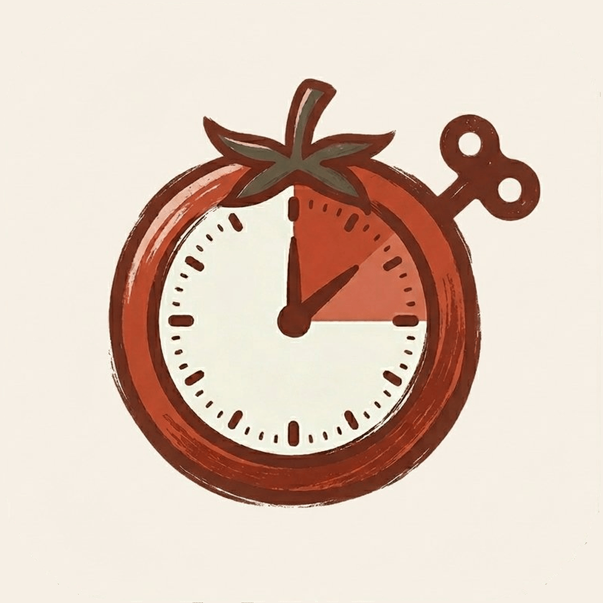
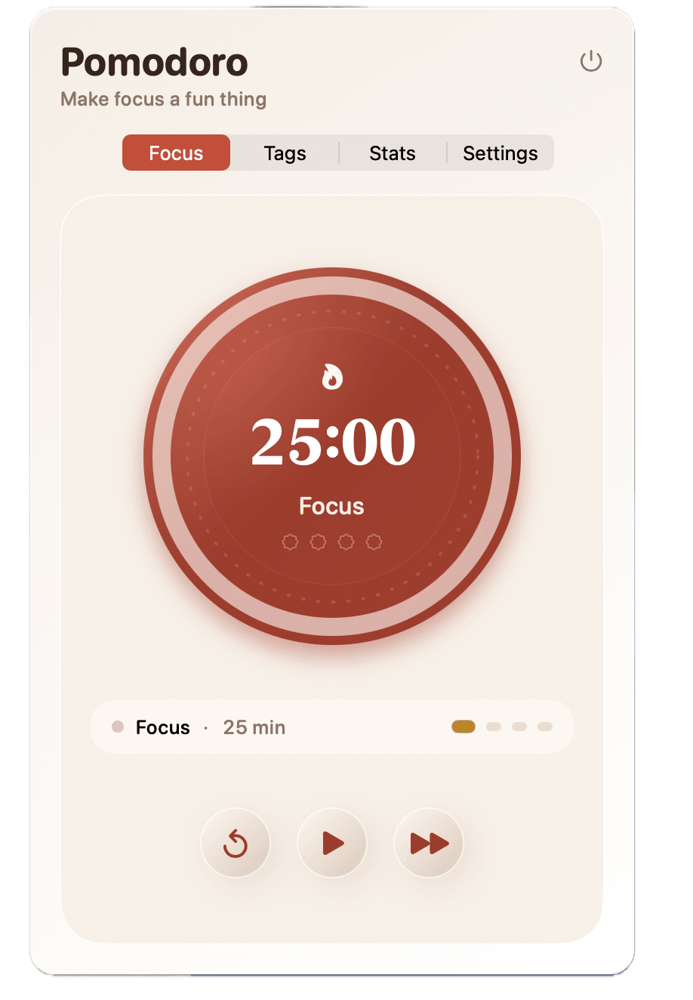

# Pomodoro

A minimal, distraction-free Pomodoro timer that lives in your menu bar.




## Preview


## Features

- **Menu bar first** — clock ticks quietly in your menu bar; never clutters your dock
- **Floating timer panel** — a drag-anywhere overlay that stays out of your way
- **Full phase control** — work · short break · long break; start, pause, skip, reset at will
- **Flexible config** — tweak session lengths, long-break interval, and auto-start behavior
- **Tags** — label focus sessions to see where your time actually goes
- **Stats dashboard** — 14-day bar chart, 30-day trend line, 70-day heatmap, per-tag donut
- **System notifications** — native alerts when a phase ends, with sound toggle

## Requirements

- macOS 14+

## Build

```bash
xcodegen generate
open Pomodoro.xcodeproj
```

## License

MIT with Commons Clause
